# SYSTEM_MAP.md — StoreVoice System Components Map

**Purpose:** Visual and textual map of all system components and their relationships.

**Status:** DECISION

**Scope:** This document provides a comprehensive view of the StoreVoice system structure, including control plane, interaction plane, data boundaries, regional processing, and the Voice Engine boundary.

**Important:** This is TARGET ARCHITECTURE. Diagrams represent the designed system, not currently implemented components. The Voice Engine boundary is a TARGET architecture, not a currently existing public API.

---

## 1. High-Level System Map

```mermaid
graph TB
    subgraph "External"
        Customer["Customer<br/>(Phone / WhatsApp / Email / SMS)"]
    end

    subgraph "StoreVoice Platform"
        subgraph "Control Plane"
            Identity["Identity & Tenant Management"]
            CustomerAdmin["Customer Administration"]
            Packages["Package & Entitlement Management"]
            KnowledgeMgmt["Knowledge Management"]
            Config["AI Colleague Configuration"]
            Localization["Localization Configuration"]
            Billing["Billing & Subscription"]
            Compliance["Compliance & Regulatory"]
            Audit["Audit & Traceability"]
            Incidents["Incident Management"]
            Onboarding["Onboarding Management"]
            Demo["Demo Management"]
            Providers["Provider Configuration"]
        end

        subgraph "Interaction Plane"
            Channels["Channel Management"]
            Sessions["Session Management"]
            AIRuntime["AI Colleague Runtime"]
            KnowledgeRetrieval["Knowledge Retrieval"]
            Context["Context Management"]
            Escalation["Escalation Orchestration"]
            Tools["Tool Execution"]
            Events["Real-time Event Processing"]
        end

        subgraph "Operations Plane"
            QA["Quality Assurance"]
            Reporting["Reporting & Insight"]
            HumanEsc["Human Escalation Management"]
            WhiteGlove["White Glove Operations"]
        end
    end

    subgraph "Voice Engine Boundary"
        Boundary["Stable Interface"]
    end

    subgraph "External Systems"
        VoiceEngine["Frozen Voice Engine<br/>(LiveKit Agents / Deepgram / OpenAI / Cartesia)"]
        Twilio["Twilio<br/>(Telephony)"]
        Stripe["Stripe<br/>(Payments)"]
        Cloud["Cloud Infrastructure"]
    end

    Customer --> Channels
    Channels --> Sessions
    Sessions --> AIRuntime
    AIRuntime --> Boundary
    Boundary --> VoiceEngine
    Channels --> Twilio
    Billing --> Stripe
    Identity --> Cloud
    AIRuntime --> KnowledgeRetrieval
    AIRuntime --> Context
    AIRuntime --> Escalation
    AIRuntime --> Tools
    Sessions --> Events
    KnowledgeMgmt --> KnowledgeRetrieval
    Config --> AIRuntime
    Compliance --> AIRuntime
    Audit --> Events
    Incidents --> Events
    QA --> Reporting
    HumanEsc --> Escalation
    WhiteGlove --> HumanEsc
```

---

## 2. Control Plane Detail

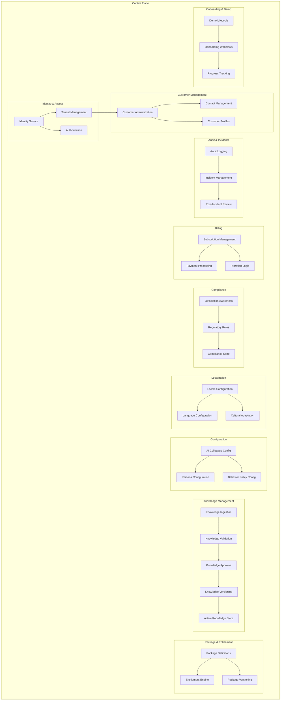

---

## 3. Interaction Plane Detail

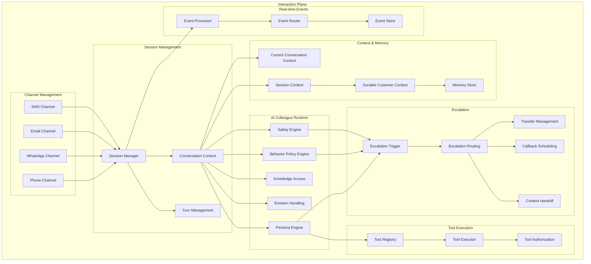

---

## 4. Data Boundaries

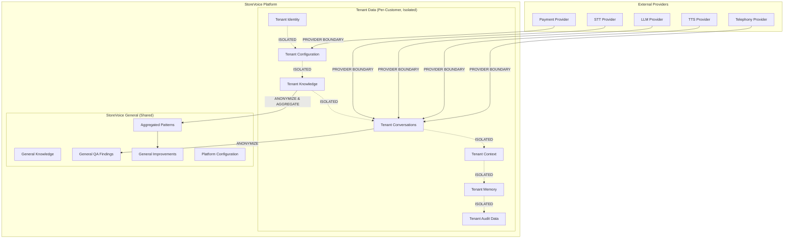

### Data Isolation Rules

| Data Type | Isolation | Cross-Tenant Access | Deletion |
|-----------|-----------|---------------------|----------|
| Tenant Identity | Strict | NEVER | After legal retention |
| Tenant Configuration | Strict | NEVER | After legal retention |
| Tenant Knowledge | Strict | NEVER | After termination + 14 days |
| Tenant Conversations | Strict | NEVER | After termination + 14 days |
| Tenant Context | Strict | NEVER | After termination + 14 days |
| Tenant Memory | Strict | NEVER | After termination + 14 days |
| Tenant Audit | Strict | NEVER | After legal retention |
| General Knowledge | Shared | By design | N/A |
| General QA | Shared (anonymized) | By design | N/A |
| General Patterns | Shared (anonymized) | By design | N/A |

---

## 5. Regional Processing

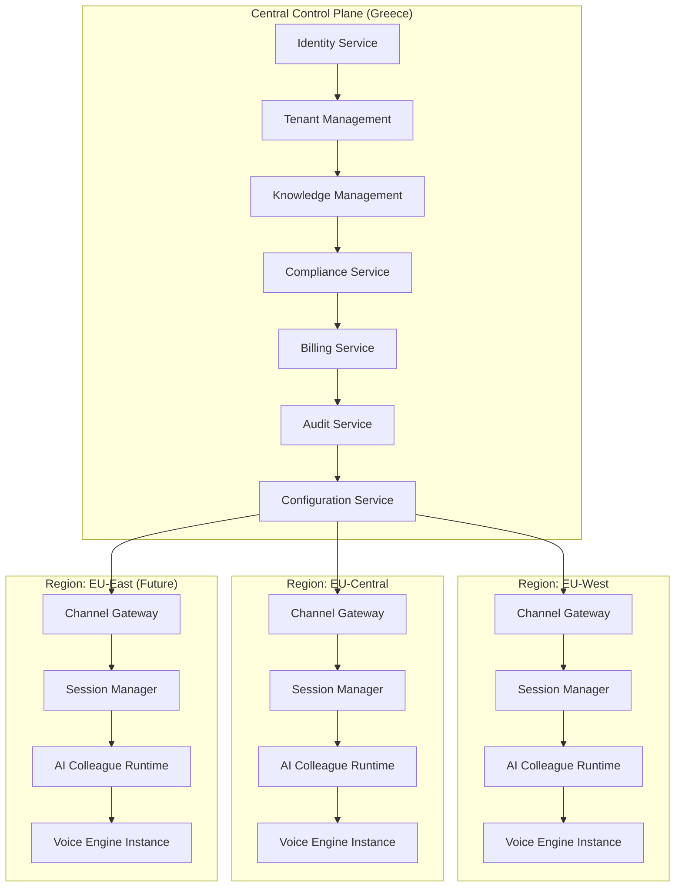

### Regional Processing Triggers

| Trigger | Reason | Example |
|---------|--------|---------|
| Compliance | Data residency requirements | EU data protection |
| Latency | Voice processing proximity | Real-time conversation |
| Resilience | Geographic distribution | Disaster recovery |
| Capacity | Load distribution | Peak hours |
| Provider Availability | Provider regional presence | Provider outage |

### Regional Processing Rules

* Central control plane is the authoritative source
* Regional processing remains subordinate to the central platform
* Regional processing does NOT create independent national platforms
* Regional processing does NOT create independent product standards
* Configuration is centrally managed; regional execution is distributed

---

## 6. Voice Engine Boundary

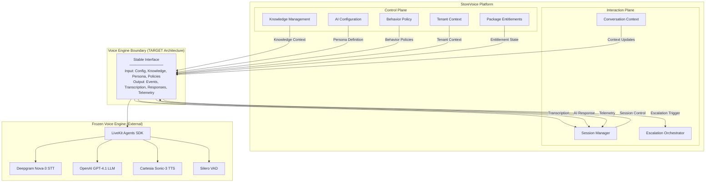

### Boundary Interface Specification

#### Inputs (Platform → Engine)

| Input | Type | Description | Required |
|-------|------|-------------|----------|
| Session Configuration | Object | Channel, language, tenant ID | Yes |
| Knowledge Context | Array | Approved knowledge items for this tenant | Yes |
| Persona Definition | Object | Name, role, personality, style | Yes |
| Behavior Policies | Array | What AI may/may not do | Yes |
| System Prompt | String | Base prompt with knowledge and policies | Yes |
| Channel Parameters | Object | Phone number, caller info, etc. | Yes |
| Entitlement State | Object | Package capabilities available | Yes |

#### Outputs (Engine → Platform)

| Output | Type | Description | Required |
|--------|------|-------------|----------|
| Transcription | String | What the user said | Yes |
| AI Response | String | What the AI said | Yes |
| Conversation Events | Array | Turn, interruption, pause, etc. | Yes |
| Escalation Trigger | Object | When escalation is needed | Conditional |
| Telemetry | Object | Latency, errors, metrics | Yes |
| Error Events | Object | When something goes wrong | Yes |

### Boundary Versioning

| Version | Status | Compatibility |
|---------|--------|---------------|
| v1.0 | TARGET | Initial design |
| Future | TBD | Backward compatible within major versions |

### Boundary Replacement

The boundary must support:

```
Current Engine → Adapter → Future Engine
```

Without reconstructing the StoreVoice platform.

---

## 7. Customer Lifecycle State Machine

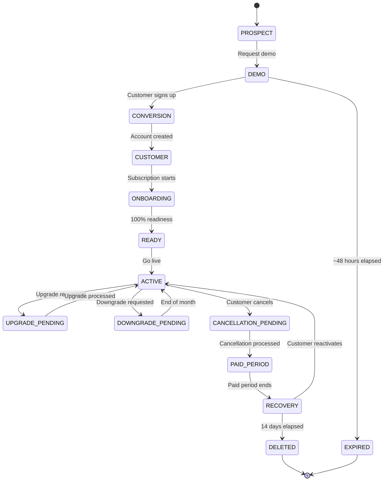

---

## 8. Knowledge Lifecycle

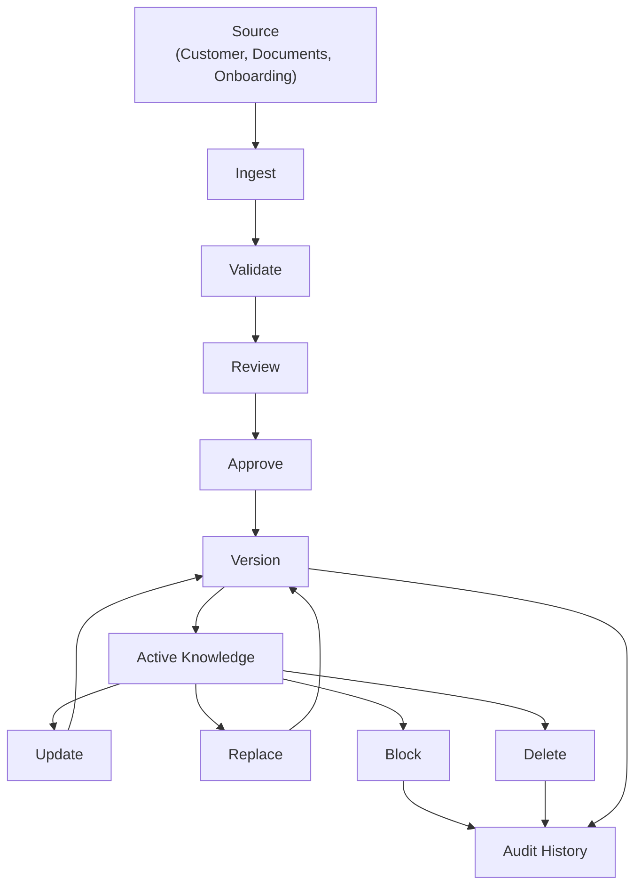

---

## 9. Escalation Flow

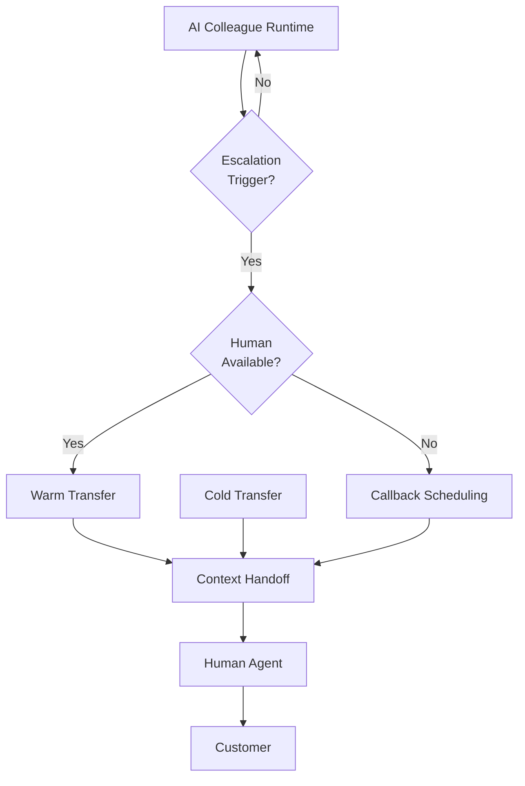

---

## 10. Provider Abstraction Map

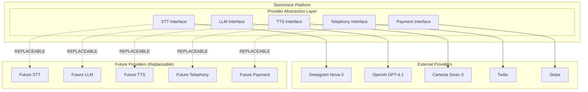

---

## 11. Deployment Topology

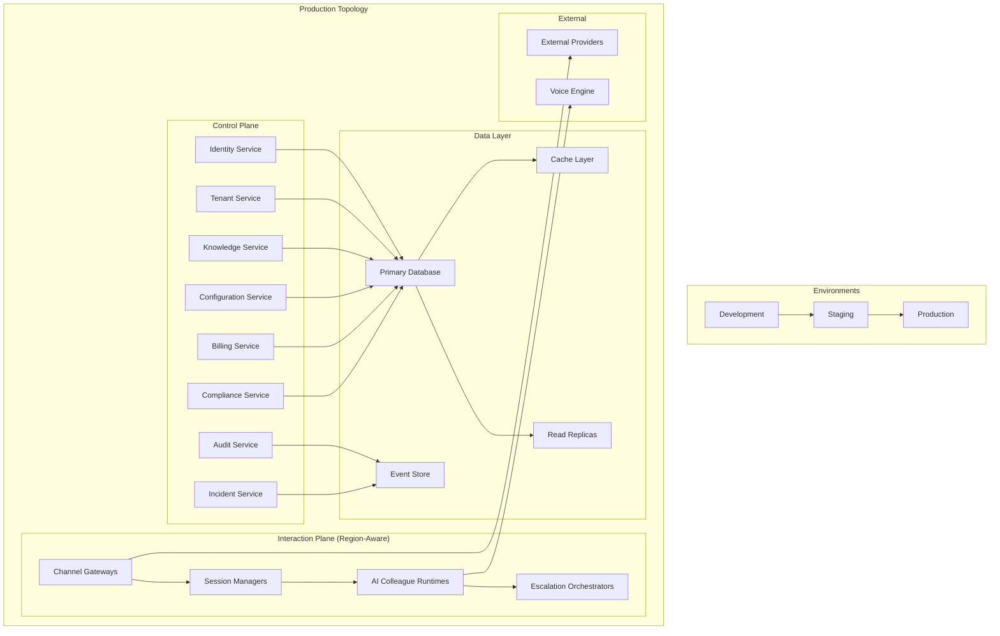

---

## 12. Security Architecture Map

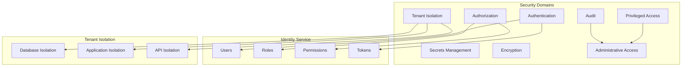

---

## Component Interaction Summary

| Component | Interacts With | Direction | Purpose |
|-----------|---------------|-----------|---------|
| Customer | Channel Gateway | Inbound | Customer initiates contact |
| Channel Gateway | Session Manager | Inbound | Route to session |
| Session Manager | AI Colleague Runtime | Bidirectional | Manage conversation |
| AI Colleague Runtime | Voice Engine Boundary | Outbound | Start voice session |
| Voice Engine Boundary | Frozen Voice Engine | Outbound | Execute voice processing |
| AI Colleague Runtime | Knowledge Retrieval | Outbound | Get approved knowledge |
| AI Colleague Runtime | Context Management | Bidirectional | Read/write context |
| AI Colleague Runtime | Escalation Orchestrator | Outbound | Trigger escalation |
| Escalation Orchestrator | Human Agent | Outbound | Connect to human |
| Control Plane | Interaction Plane | Bidirectional | Configure and monitor |
| Control Plane | External Providers | Outbound | Manage integrations |
| Audit Service | Event Store | Inbound | Record audit events |
| Incident Service | Event Store | Inbound | Record incidents |

---

## Rules for Future Updates

- Component changes require human owner approval
- All modifications must be recorded in `05_DECISIONS/CHANGELOG.md`
- Changes must follow the governance workflow in `AGENTS.md`
- Component updates may require corresponding updates to ARCHITECTURE.md
- Diagrams must remain logically consistent with ARCHITECTURE.md
- Future APIs are clearly marked as TARGET architecture where they do not currently exist

---

**Last Updated:** 2026-09-04
**Approved By:** Change 004C — Architecture Design